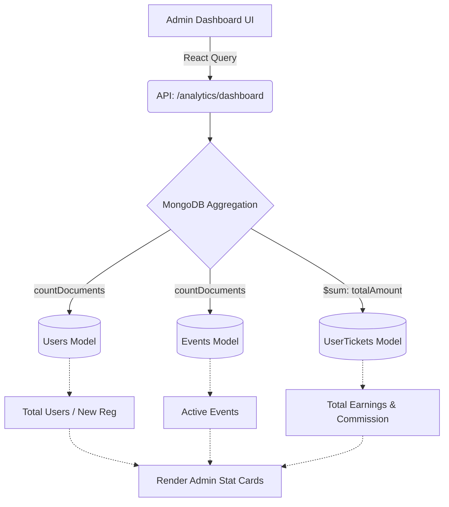
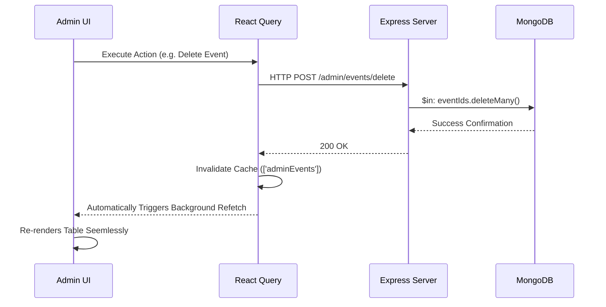

# Rbooking Platform

Rbooking is a comprehensive, full-stack event booking and ticket management platform that serves both consumer-facing clients and backend administrative operations. Built using the MERN stack (MongoDB, Express, React, Node.js), it incorporates modern aesthetics with complex data flow bridging ticketing, user sessions, and graphical analytics.

---

## Technical Overview
- **Frontend Stack**: React (Vite), Tailwind CSS, Framer Motion, TanStack React Query, Lucide React (Iconography).
- **Backend Stack**: Node.js, Express.js, MongoDB (Mongoose), JWT, Google OAuth.
- **Key Characteristics**: Implements advanced dark-theme cinematic glassmorphism UI logic, dynamic form handling, ticket physical "stubs" visualization, and an robust data-aggregating analytical engine for system administrators.

---

## Administrative Dashboard Operations

The Admin application resides under the `/admin/*` routing umbrella safely segmented from the client-facing portals. It enables high-level platform visualization and deep CRUD management of the platform's lifecycle.

### 1. The Reporting & Analytical Engine
Leveraging customized aggregation pipelines on the MongoDB server (`Server/controllers/analyticsController.js`), the Admin console visualizes the platform's operation history without the use of third-party analytic software.
*   **The Hub (`/admin/home`)**: An overview array tracking high-level system metrics (Total Users, New Registrations, Live Events, and Pending Clearances).
*   **Ledgers (`/admin/payment`)**: An automated commission and transaction interface dynamically fetching lifetime revenue statistics and projecting platform cuts based upon a set logic commission rule over `UserTicketModel` items.

### 2. Events & Ticketing Lifecycle Management
*   **Event Portal (`/admin/events`)**: Enables detailed CRUD interactions. Admins can create categorizations (`concert`, `festival`, `generic`) utilizing the customized `CustomSelect` component, upload poster images through `multer` disk storage, establish capacity guidelines, and dictate physical venue/digital locales.
*   **Order Fulfillment (`/admin/orders`)**: Maps directly onto consumer cart transactions, tracking and filtering orders between "Pending" and "Paid" statuses via the backend ticket routes.

### 3. Moderation & User Accounts
*   **Identity System (`/admin/users`)**: A unified space for mapping the active consumer population. Admins hold capabilities to modify Permission Levels and trigger temporal suspensions or permanent Account Bans, updating the `UserModel` statuses directly.
*   **Account Controls (`/admin/profile`)**: For self-service, Admins can access a distinct, premium-themed interface tracking personal authentication actions via Audit Logs, and manage multi-factor/rotational password configurations directly from the console.

---

## State Management & Fetching Patterns

Within the Admin Client context, we depend primarily entirely on `useQuery` and `useMutation` via **React Query** hooked intimately into the Application's custom context service (`useService`) which holds environmental variables like the target `API_URL`. This eliminates standard prop-drilling or overly complex Redux structures and delegates cache invalidations directly to HTTP success callbacks.

